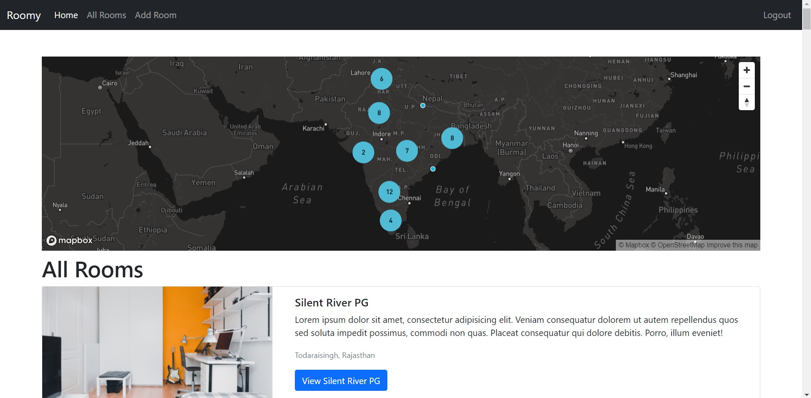

# Roomy

A website to find rooms for rent. Search for PGs, review them or list your own rooms!

## Features

Roomy is a node.js app with full CRUD(Create, Read, Update, Delete) functionality for rooms and their reviews.

--------

Add multiple images on an interactive carousel.

Just type in your location and your PG will show up on a map! This is done via the mapbox API which uses geocoding.

The homepage has a cluster map with all the PGs which makes finding PGs near your location easier.

This website has full authentication and authorization for users to edit their own PGs. This was done using Passport.js.

## Tech Stack
* HTML 
* CSS 
* Bootstrap 
* JavaScript 
* Express 
* Node.js 
* MongoDB 
* Passport.js.

## URL
https://frozen-savannah-39290.herokuapp.com/

## Contributing
Pull requests are welcome. For major changes, please open an issue first to discuss what you would like to change.

Please make sure to update tests as appropriate.
